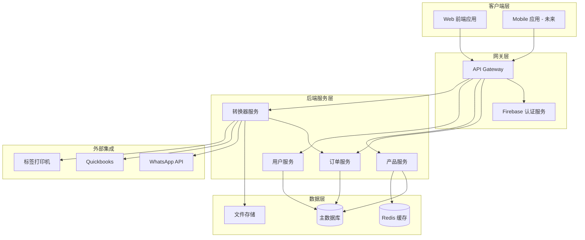
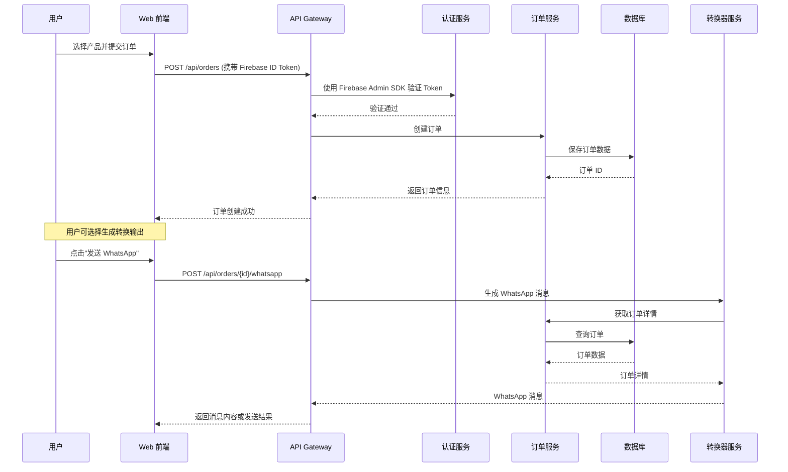
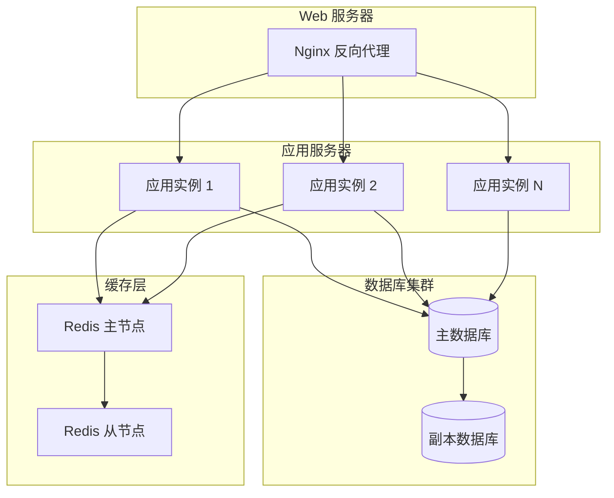

# 系统架构设计

## 架构概览

NiceOne 系统采用前后端分离的微服务架构，支持高并发和可扩展性。

## 系统架构图



## 组件说明

### 1. 客户端层

#### Web 前端应用
- **技术**: HTML5, JavaScript (Vanilla/React), Tailwind CSS
- **职责**: 
  - 用户界面渲染
  - 用户交互处理
  - API 调用
  - 本地状态管理

### 2. 网关层

#### API Gateway
- **技术**: Python FastAPI / Nginx
- **职责**:
  - 路由转发
  - 请求限流
  - 负载均衡
  - API 版本管理

#### Firebase 认证服务
- **技术**: Firebase Authentication + Firebase Admin SDK (Python)
- **支持的认证方式**: Email/Password, Google, GitHub 等
- **职责**:
  - Firebase ID Token 验证
  - 用户信息获取和管理
  - 自定义 Token 生成（如需要）
  - 白名单验证
  - 用户会话管理

### 3. 后端服务层

#### 订单服务 (Order Service)
- **技术**: Python FastAPI
- **职责**:
  - 订单创建、查询、更新
  - 订单状态管理
  - 订单验证
  - 与数据库交互

#### 产品服务 (Product Service)
- **技术**: Python FastAPI
- **职责**:
  - 产品信息管理
  - 产品分类
  - 价格管理
  - 库存查询（可选）

#### 用户服务 (User Service)
- **技术**: Python FastAPI
- **职责**:
  - 用户信息管理
  - 白名单管理
  - 等待列表管理
  - 客户信息管理

#### 转换器服务 (Convertor Service)
- **技术**: Python FastAPI
- **职责**:
  - WhatsApp 消息生成（IM Connector）
  - Quickbooks IIF 文件生成（Quickbooks Convertor）
  - 打印标签文件生成（Printer Convertor）
  - 文件存储管理

### 4. 数据层

#### 主数据库
- **可选方案**: PostgreSQL, MySQL, MongoDB
- **存储内容**:
  - 用户信息
  - 产品信息
  - 订单数据
  - 白名单数据
  - 等待列表数据

#### Redis 缓存
- **用途**:
  - 产品信息缓存
  - Session 存储
  - 限流计数器

#### 文件存储
- **用途**:
  - IIF 文件存储
  - 打印文件存储
  - 临时文件

### 5. 外部集成

#### WhatsApp API
- **集成方式**: WhatsApp Business API / 第三方服务
- **用途**: 发送订单通知消息

#### Quickbooks
- **集成方式**: IIF 文件导入
- **用途**: 会计数据同步

#### 标签打印机
- **集成方式**: 打印队列 / 文件输出
- **用途**: 批量打印订单标签

## 数据流向

### 订单创建流程



## 技术栈详情

### 后端技术栈

| 组件 | 技术选型 | 说明 |
|------|---------|------|
| Web 框架 | FastAPI | 高性能异步框架 |
| ORM | SQLAlchemy / Tortoise ORM | 数据库抽象层 |
| 认证 | Firebase Admin SDK | Firebase Authentication 后端验证 |
| 缓存 | Redis + aioredis | 缓存客户端 |
| 任务队列 | Celery / RQ | 异步任务处理（可选） |
| 文件处理 | Jinja2 | 模板渲染 |

### 前端技术栈

| 组件 | 技术选型 | 说明 |
|------|---------|------|
| UI 框架 | Tailwind CSS | 实用优先的 CSS 框架 |
| JavaScript | Vanilla JS / React | 根据需求选择 |
| 认证 SDK | Firebase Authentication SDK | Firebase 前端认证 |
| HTTP 客户端 | Fetch API / Axios | API 调用 |
| QR Code | qrcodejs | QR 码生成 |

### 数据库设计

- **关系型数据库** (推荐): PostgreSQL
  - 适合复杂查询和事务
  - 支持 JSON 字段存储灵活数据
  
- **文档数据库** (可选): MongoDB
  - 适合灵活的订单数据结构
  - 易于扩展

## 部署架构

### 开发环境
```
前端 (localhost:3000) → 后端 API (localhost:8000) → 数据库 (localhost:5432)
```

### 生产环境



## 安全考虑

1. **认证与授权**
   - Firebase Authentication 标准流程
   - Firebase ID Token 用于 API 认证
   - Token 自动刷新机制
   - 后端使用 Admin SDK 验证 Token

2. **数据安全**
   - HTTPS 加密传输
   - 数据库连接加密
   - 敏感数据加密存储

3. **API 安全**
   - 请求限流
   - CORS 配置
   - 输入验证和清理
   - SQL 注入防护

4. **白名单机制**
   - 基于数据库的白名单表
   - 管理员可动态管理

## 性能优化

1. **缓存策略**
   - 产品信息缓存（Redis）
   - 静态资源 CDN 加速

2. **数据库优化**
   - 索引优化
   - 查询优化
   - 连接池管理

3. **异步处理**
   - 文件生成异步化
   - 消息发送队列化

4. **负载均衡**
   - 多实例部署
   - 水平扩展

## 监控与日志

1. **应用监控**
   - 性能指标采集
   - 错误追踪
   - 健康检查端点

2. **日志管理**
   - 结构化日志
   - 日志聚合
   - 日志分析

## 扩展性考虑

1. **水平扩展**: 无状态服务设计，支持多实例部署
2. **数据库扩展**: 支持读写分离、分库分表
3. **微服务拆分**: 可按业务域进一步拆分服务
4. **消息队列**: 可引入消息队列处理异步任务
