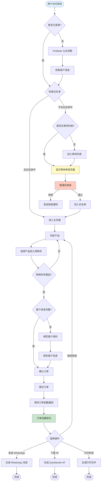
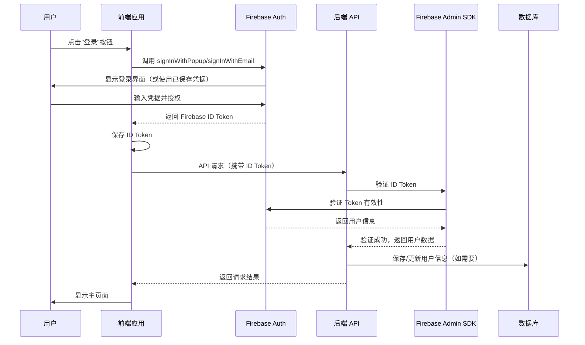
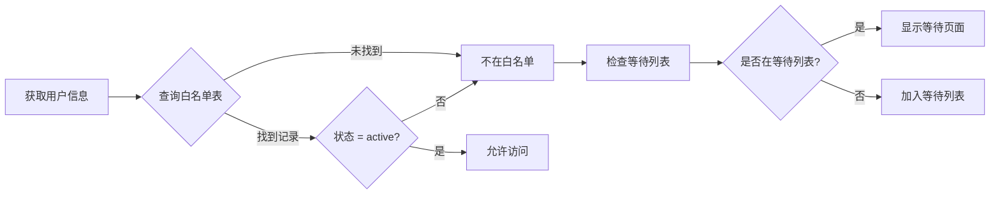
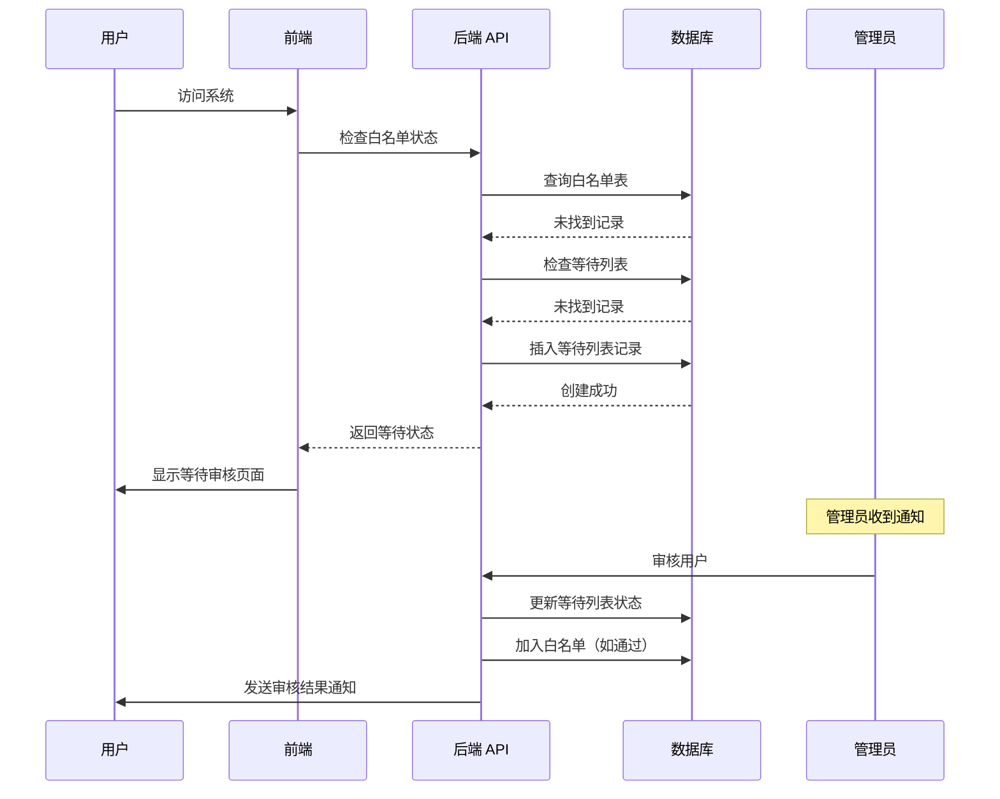
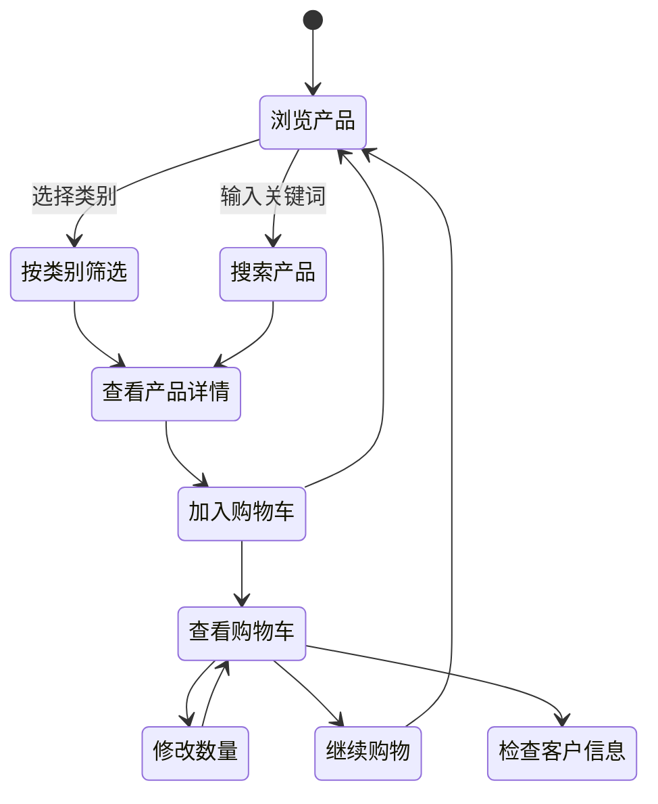
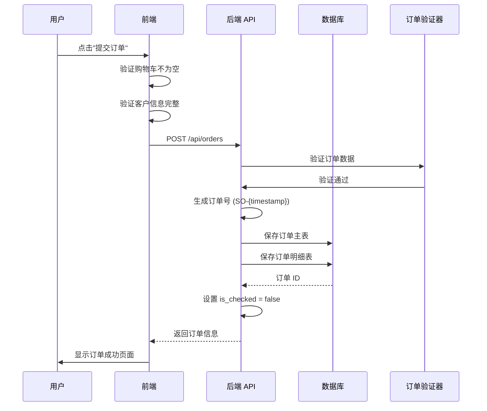
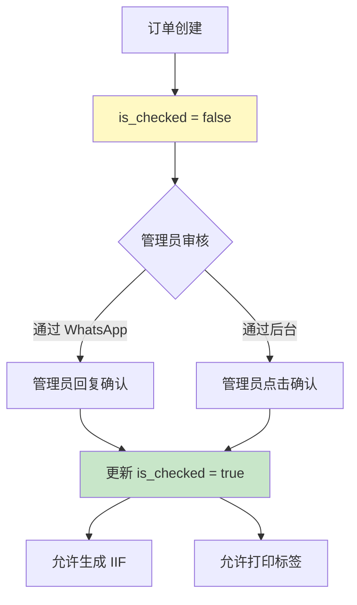
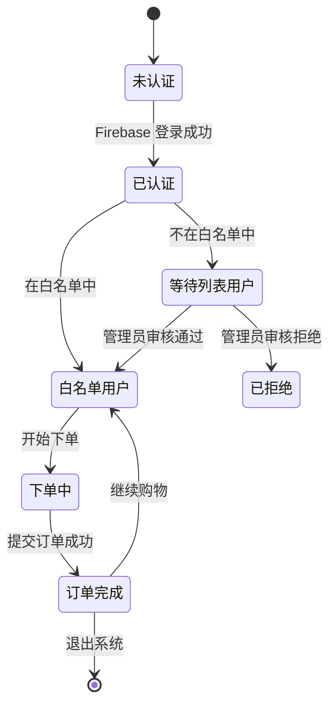
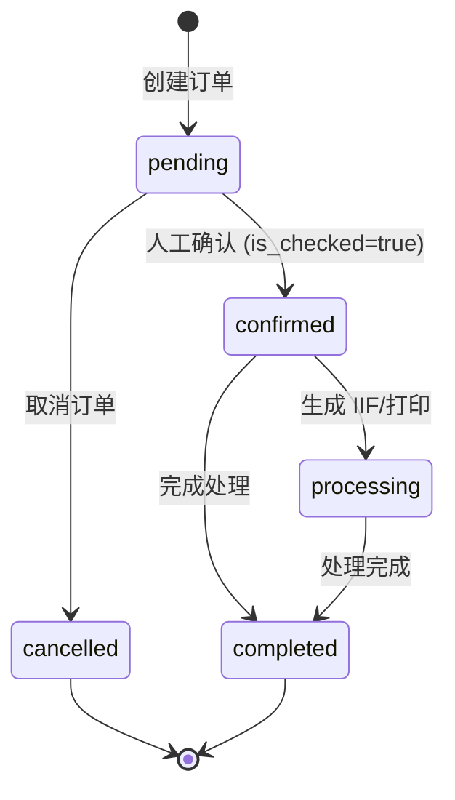

# 用户旅程设计

## 用户旅程概览

本文档详细描述 NiceOne 系统中用户从访问到完成订单的完整流程，包括认证、白名单检查、下单和等待列表处理。

## 主要用户角色

1. **白名单用户**: 已通过审核，可以直接下单的客户
2. **等待列表用户**: 新申请用户，等待管理员审核
3. **管理员**: 管理系统、审核用户、处理订单

## 完整用户旅程

### 流程图



## 详细流程说明

### 1. 用户认证流程

#### 1.1 Firebase 认证步骤



#### 1.2 支持的认证方式

- **Email/Password 认证**
  - 用户注册和登录
  - 密码重置功能
  
- **Google 登录**
  - 通过 Firebase Google Provider
  - 自动获取用户信息
  
- **GitHub 登录**（可选）
  - 通过 Firebase GitHub Provider
  - 自动获取用户信息

#### 1.3 Token 管理

- **Firebase ID Token**: Firebase Authentication 返回的 ID Token
- **Token 验证**: 后端使用 Firebase Admin SDK 验证 Token
- **Token 自动刷新**: Firebase SDK 自动处理 Token 刷新
- **Token 有效期**: 
  - ID Token: 1 小时（Firebase 自动刷新）
  - Refresh Token: Firebase 自动管理

### 2. 白名单检查流程

#### 2.1 白名单验证逻辑



#### 2.2 白名单表结构

| 字段 | 类型 | 说明 |
|------|------|------|
| id | INTEGER | 主键 |
| user_email | VARCHAR | 用户邮箱（唯一） |
| user_name | VARCHAR | 用户名称 |
| status | ENUM | 'active', 'inactive', 'suspended' |
| created_at | TIMESTAMP | 创建时间 |
| updated_at | TIMESTAMP | 更新时间 |
| approved_by | INTEGER | 审核人 ID |

#### 2.3 API 端点

```
GET /api/auth/check-whitelist
Headers: Authorization: Bearer {firebase_id_token}

Response:
{
  "in_whitelist": true,
  "user_info": {
    "email": "user@example.com",
    "name": "User Name"
  },
  "status": "active"
}
```

### 3. 等待列表流程

#### 3.1 加入等待列表

当用户不在白名单时，系统自动将其加入等待列表：



#### 3.2 等待列表页面内容

- 友好的提示信息
- 显示申请状态
- 说明审核流程
- 联系信息（可选）

#### 3.3 管理员审核流程

1. 管理员登录后台
2. 查看等待列表
3. 审核用户信息
4. 决定通过或拒绝
5. 系统自动发送通知

### 4. 下单流程

#### 4.1 产品浏览与选择



#### 4.2 购物车管理

**购物车数据结构**:
```javascript
{
  "P1001": 5,  // product_id: quantity
  "P1002": 3,
  "P1005": 10
}
```

**操作**:
- 添加产品: 增加数量
- 移除产品: 减少数量或删除
- 清空购物车: 清除所有商品

#### 4.3 客户信息管理

**必填字段**:
- 客户名称 (customer_name)
- 客户编号 (customer_id) - Quickbooks ID
- 电话 (phone)
- 地址 (address)

**保存机制**:
- 前端 localStorage 临时保存
- 提交订单时验证完整性
- 订单成功后保存到数据库

#### 4.4 订单提交流程



#### 4.5 订单数据结构

**订单主表**:
```
order_id: SO-123456
customer_id: CUST001
customer_name: ABC Company
total_amount: 5000.00
status: 'pending'
is_checked: false
created_at: 2024-01-01 10:00:00
```

**订单明细表**:
```
order_id: SO-123456
product_id: P1001
product_name: 力士香皂(混合)
product_spec: 80g x6s x24扎
quantity: 5
unit_price: 264.00
subtotal: 1320.00
```

### 5. 订单后处理

#### 5.1 可选操作

订单创建成功后，用户可以选择以下操作：

1. **发送 WhatsApp 消息**
   - 通过 IM Connector 生成消息
   - 打开 WhatsApp 应用发送

2. **下载 Quickbooks IIF 文件**
   - 通过 Quickbooks Convertor 生成
   - 下载到本地，导入 Quickbooks

3. **生成打印标签**
   - 通过 Printer Convertor 生成
   - 显示 QR Code 供扫描
   - 或直接下载打印文件

#### 5.2 人工确认流程



### 6. 异常流程处理

#### 6.1 认证失败
- 显示错误信息
- 提供重新登录选项
- 记录错误日志

#### 6.2 白名单检查失败
- 自动加入等待列表
- 显示友好提示
- 记录检查日志

#### 6.3 订单提交失败
- 显示具体错误原因
- 保留购物车数据
- 允许重新提交

#### 6.4 网络错误
- 显示重试选项
- 本地数据备份
- 自动重试机制（可选）

## 状态转换图

### 用户状态转换



### 订单状态转换



## 用户体验优化

1. **加载状态**: 显示加载动画，避免用户等待焦虑
2. **错误提示**: 清晰的错误信息和解决建议
3. **数据持久化**: 购物车和客户信息本地保存
4. **响应式设计**: 支持移动端和桌面端
5. **快捷操作**: 常用功能快捷入口
6. **操作反馈**: 成功/失败操作的即时反馈

## 性能要求

1. **页面加载**: < 2 秒
2. **API 响应**: < 500ms (95 分位)
3. **订单提交**: < 1 秒
4. **文件生成**: < 5 秒

## 可访问性

1. 键盘导航支持
2. 屏幕阅读器兼容
3. 色彩对比度符合 WCAG 标准
4. 多语言支持（中文/英文）
