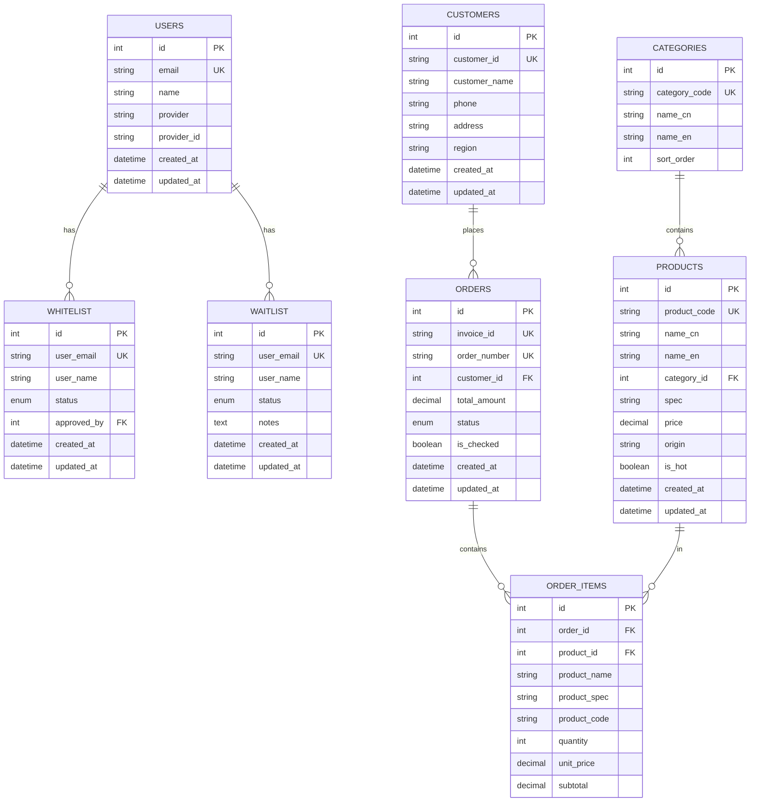

# 数据模型设计

## 数据模型概览

本文档定义 NiceOne 系统的数据库表结构，包括订单、客户、产品、白名单、等待列表等核心实体。

## 实体关系图 (ER Diagram)



## 数据表结构

### 1. USERS (用户表)

存储通过 Firebase Authentication 认证的用户信息。

| 字段名 | 类型 | 约束 | 说明 |
|--------|------|------|------|
| id | INTEGER | PK, AUTO_INCREMENT | 主键 |
| email | VARCHAR(255) | UNIQUE, NOT NULL | 用户邮箱（唯一标识） |
| name | VARCHAR(255) | NOT NULL | 用户名称 |
| provider | VARCHAR(50) | NOT NULL | Firebase 认证提供商 (google.com/github.com/password 等) |
| provider_id | VARCHAR(255) | NOT NULL | 提供商中的用户 ID |
| avatar_url | VARCHAR(500) | NULL | 头像 URL |
| created_at | TIMESTAMP | NOT NULL, DEFAULT NOW() | 创建时间 |
| updated_at | TIMESTAMP | NOT NULL, DEFAULT NOW() ON UPDATE NOW() | 更新时间 |

**索引**:
- PRIMARY KEY (id)
- UNIQUE KEY (email)
- INDEX (provider, provider_id)

**示例数据**:
```sql
INSERT INTO users (email, name, provider, provider_id) VALUES
('user@example.com', 'John Doe', 'google', '123456789');
```

### 2. WHITELIST (白名单表)

存储已授权的用户白名单。

| 字段名 | 类型 | 约束 | 说明 |
|--------|------|------|------|
| id | INTEGER | PK, AUTO_INCREMENT | 主键 |
| user_email | VARCHAR(255) | UNIQUE, NOT NULL | 用户邮箱（唯一标识） |
| user_name | VARCHAR(255) | NOT NULL | 用户名称 |
| status | ENUM | NOT NULL, DEFAULT 'active' | 状态: active/inactive/suspended |
| approved_by | INTEGER | NULL, FK(users.id) | 审核人 ID |
| notes | TEXT | NULL | 备注 |
| created_at | TIMESTAMP | NOT NULL, DEFAULT NOW() | 创建时间 |
| updated_at | TIMESTAMP | NOT NULL, DEFAULT NOW() ON UPDATE NOW() | 更新时间 |

**索引**:
- PRIMARY KEY (id)
- UNIQUE KEY (user_email)
- INDEX (status)
- FOREIGN KEY (approved_by) REFERENCES users(id)

**状态说明**:
- `active`: 激活状态，可以下单
- `inactive`: 停用状态，暂时不能下单
- `suspended`: 暂停状态，被管理员暂停

**示例数据**:
```sql
INSERT INTO whitelist (user_email, user_name, status, approved_by) VALUES
('user@example.com', 'John Doe', 'active', 1);
```

### 3. WAITLIST (等待列表表)

存储等待审核的用户申请。

| 字段名 | 类型 | 约束 | 说明 |
|--------|------|------|------|
| id | INTEGER | PK, AUTO_INCREMENT | 主键 |
| user_email | VARCHAR(255) | UNIQUE, NOT NULL | 用户邮箱（唯一标识） |
| user_name | VARCHAR(255) | NOT NULL | 用户名称 |
| status | ENUM | NOT NULL, DEFAULT 'pending' | 状态: pending/approved/rejected |
| notes | TEXT | NULL | 备注 |
| reviewed_by | INTEGER | NULL, FK(users.id) | 审核人 ID |
| reviewed_at | TIMESTAMP | NULL | 审核时间 |
| created_at | TIMESTAMP | NOT NULL, DEFAULT NOW() | 创建时间 |
| updated_at | TIMESTAMP | NOT NULL, DEFAULT NOW() ON UPDATE NOW() | 更新时间 |

**索引**:
- PRIMARY KEY (id)
- UNIQUE KEY (user_email)
- INDEX (status)
- INDEX (created_at)
- FOREIGN KEY (reviewed_by) REFERENCES users(id)

**状态说明**:
- `pending`: 等待审核
- `approved`: 已通过，应加入白名单
- `rejected`: 已拒绝

**示例数据**:
```sql
INSERT INTO waitlist (user_email, user_name, status) VALUES
('newuser@example.com', 'Jane Smith', 'pending');
```

### 4. CUSTOMERS (客户表)

存储客户信息。

| 字段名 | 类型 | 约束 | 说明 |
|--------|------|------|------|
| id | INTEGER | PK, AUTO_INCREMENT | 主键 |
| customer_id | VARCHAR(50) | UNIQUE, NOT NULL | 客户编号（Quickbooks ID） |
| customer_name | VARCHAR(255) | NOT NULL | 客户名称 |
| phone | VARCHAR(50) | NOT NULL | 电话 |
| address | TEXT | NOT NULL | 地址 |
| region | VARCHAR(100) | NULL | 区域 |
| notes | TEXT | NULL | 备注 |
| created_at | TIMESTAMP | NOT NULL, DEFAULT NOW() | 创建时间 |
| updated_at | TIMESTAMP | NOT NULL, DEFAULT NOW() ON UPDATE NOW() | 更新时间 |

**索引**:
- PRIMARY KEY (id)
- UNIQUE KEY (customer_id)
- INDEX (customer_name)
- INDEX (region)

**示例数据**:
```sql
INSERT INTO customers (customer_id, customer_name, phone, address, region) VALUES
('CUST001', 'ABC Company', '12345678', 'Hong Kong', 'HK');
```

### 5. ORDERS (订单主表)

存储订单主信息。

| 字段名 | 类型 | 约束 | 说明 |
|--------|------|------|------|
| id | INTEGER | PK, AUTO_INCREMENT | 主键 |
| invoice_id | VARCHAR(50) | UNIQUE, NOT NULL | 发票 ID（唯一） |
| order_number | VARCHAR(50) | UNIQUE, NOT NULL | 订单编号 (SO-{timestamp}) |
| customer_id | INTEGER | NOT NULL, FK(customers.id) | 客户 ID |
| customer_name | VARCHAR(255) | NOT NULL | 客户名称（冗余字段） |
| total_amount | DECIMAL(10,2) | NOT NULL, DEFAULT 0.00 | 总金额 |
| status | ENUM | NOT NULL, DEFAULT 'pending' | 状态: pending/confirmed/processing/completed/cancelled |
| is_checked | BOOLEAN | NOT NULL, DEFAULT FALSE | 是否人工确认 |
| notes | TEXT | NULL | 备注（AI 生成） |
| created_at | TIMESTAMP | NOT NULL, DEFAULT NOW() | 创建时间 |
| updated_at | TIMESTAMP | NOT NULL, DEFAULT NOW() ON UPDATE NOW() | 更新时间 |

**索引**:
- PRIMARY KEY (id)
- UNIQUE KEY (invoice_id)
- UNIQUE KEY (order_number)
- INDEX (customer_id)
- INDEX (status)
- INDEX (is_checked)
- INDEX (created_at)
- FOREIGN KEY (customer_id) REFERENCES customers(id)

**状态说明**:
- `pending`: 待确认
- `confirmed`: 已确认 (is_checked=true)
- `processing`: 处理中（生成 IIF/打印文件）
- `completed`: 已完成
- `cancelled`: 已取消

**示例数据**:
```sql
INSERT INTO orders (invoice_id, order_number, customer_id, customer_name, total_amount, status, is_checked) VALUES
('INV-20240101-001', 'SO-123456', 1, 'ABC Company', 5000.00, 'pending', FALSE);
```

### 6. ORDER_ITEMS (订单明细表)

存储订单明细（每个产品一行）。

| 字段名 | 类型 | 约束 | 说明 |
|--------|------|------|------|
| id | INTEGER | PK, AUTO_INCREMENT | 主键 |
| order_id | INTEGER | NOT NULL, FK(orders.id) | 订单 ID |
| product_id | INTEGER | NOT NULL, FK(products.id) | 产品 ID |
| product_code | VARCHAR(50) | NOT NULL | 产品编号 |
| product_name | VARCHAR(255) | NOT NULL | 产品名称（冗余字段） |
| product_spec | VARCHAR(255) | NOT NULL | 产品规格 |
| quantity | INTEGER | NOT NULL, DEFAULT 1 | 数量（箱） |
| unit_price | DECIMAL(10,2) | NOT NULL | 单价 |
| subtotal | DECIMAL(10,2) | NOT NULL | 小计 (quantity * unit_price) |
| created_at | TIMESTAMP | NOT NULL, DEFAULT NOW() | 创建时间 |

**索引**:
- PRIMARY KEY (id)
- INDEX (order_id)
- INDEX (product_id)
- FOREIGN KEY (order_id) REFERENCES orders(id) ON DELETE CASCADE
- FOREIGN KEY (product_id) REFERENCES products(id)

**示例数据**:
```sql
INSERT INTO order_items (order_id, product_id, product_code, product_name, product_spec, quantity, unit_price, subtotal) VALUES
(1, 1, 'P1001', '力士香皂(混合)', '80g x6s x24扎', 5, 264.00, 1320.00),
(1, 2, 'P1002', '力士香皂(米色)', '80g x6s x24扎', 3, 270.00, 810.00);
```

### 7. PRODUCTS (产品表)

存储产品信息。

| 字段名 | 类型 | 约束 | 说明 |
|--------|------|------|------|
| id | INTEGER | PK, AUTO_INCREMENT | 主键 |
| product_code | VARCHAR(50) | UNIQUE, NOT NULL | 产品编号 (P{index+1000}) |
| name_cn | VARCHAR(255) | NOT NULL | 中文名称 |
| name_en | VARCHAR(255) | NOT NULL | 英文名称 |
| category_id | INTEGER | NOT NULL, FK(categories.id) | 分类 ID |
| spec | VARCHAR(255) | NOT NULL | 规格 |
| price | DECIMAL(10,2) | NOT NULL | 价格（9999 表示询价） |
| origin | VARCHAR(100) | NULL | 产地 |
| is_hot | BOOLEAN | NOT NULL, DEFAULT FALSE | 是否热卖 |
| is_active | BOOLEAN | NOT NULL, DEFAULT TRUE | 是否启用 |
| created_at | TIMESTAMP | NOT NULL, DEFAULT NOW() | 创建时间 |
| updated_at | TIMESTAMP | NOT NULL, DEFAULT NOW() ON UPDATE NOW() | 更新时间 |

**索引**:
- PRIMARY KEY (id)
- UNIQUE KEY (product_code)
- INDEX (category_id)
- INDEX (is_hot)
- INDEX (is_active)
- INDEX (name_cn)
- FOREIGN KEY (category_id) REFERENCES categories(id)

**价格说明**:
- 正常价格: 0.01 - 9998.99
- 询价产品: 9999.00 (需要联系询价)

**示例数据**:
```sql
INSERT INTO products (product_code, name_cn, name_en, category_id, spec, price, origin, is_hot) VALUES
('P1001', '力士香皂(混合)', 'Lux Soap (Mixed)', 2, '80g x6s x24扎', 264.00, '印尼', TRUE),
('P1002', '力士香皂(米色)', 'Lux Soap (Beige)', 2, '80g x6s x24扎', 270.00, '印尼', TRUE);
```

### 8. CATEGORIES (分类表)

存储产品分类。

| 字段名 | 类型 | 约束 | 说明 |
|--------|------|------|------|
| id | INTEGER | PK, AUTO_INCREMENT | 主键 |
| category_code | VARCHAR(50) | UNIQUE, NOT NULL | 分类代码 |
| name_cn | VARCHAR(255) | NOT NULL | 中文名称 |
| name_en | VARCHAR(255) | NOT NULL | 英文名称 |
| icon | VARCHAR(50) | NULL | 图标（emoji） |
| sort_order | INTEGER | NOT NULL, DEFAULT 0 | 排序 |
| is_active | BOOLEAN | NOT NULL, DEFAULT TRUE | 是否启用 |
| created_at | TIMESTAMP | NOT NULL, DEFAULT NOW() | 创建时间 |
| updated_at | TIMESTAMP | NOT NULL, DEFAULT NOW() ON UPDATE NOW() | 更新时间 |

**索引**:
- PRIMARY KEY (id)
- UNIQUE KEY (category_code)
- INDEX (sort_order)

**示例数据**:
```sql
INSERT INTO categories (category_code, name_cn, name_en, icon, sort_order) VALUES
('HOT_ITEMS', '熱門貨品', 'Hot Items', '🔥', 1),
('PERSONAL_CARE', '個人護理', 'Personal Care', '🧼', 2),
('CANNED_MEAT', '罐頭肉類', 'Canned Meat', '🍖', 3),
('INSTANT_MIXES', '即溶飲品', 'Instant Mixes', '☕', 4),
('SNACKS', '零食餅乾', 'Snacks', '🍪', 5),
('DAILY', '日用品', 'Daily', '🧴', 6),
('DRINKS_DAIRY', '飲品及奶類', 'Drinks & Dairy', '🥛', 7),
('SEASONING', '調味及雜項', 'Seasoning', '🧂', 8);
```

## 数据字典

### 订单状态 (ORDER_STATUS)

| 值 | 说明 | 允许转换 |
|----|------|----------|
| pending | 待确认 | → confirmed, cancelled |
| confirmed | 已确认 | → processing, completed |
| processing | 处理中 | → completed |
| completed | 已完成 | - |
| cancelled | 已取消 | - |

### 白名单状态 (WHITELIST_STATUS)

| 值 | 说明 |
|----|------|
| active | 激活 |
| inactive | 停用 |
| suspended | 暂停 |

### 等待列表状态 (WAITLIST_STATUS)

| 值 | 说明 |
|----|------|
| pending | 等待审核 |
| approved | 已通过 |
| rejected | 已拒绝 |

## 数据库设计规范

### 命名规范

1. **表名**: 复数形式，大写字母（如 `ORDERS`, `CUSTOMERS`）
2. **字段名**: 小写字母，下划线分隔（如 `customer_id`, `created_at`）
3. **索引名**: `idx_{table}_{field}` 或 `uk_{table}_{field}` (唯一索引)
4. **外键名**: `fk_{table}_{field}`

### 数据类型选择

1. **字符串**: VARCHAR(255) 用于短文本，TEXT 用于长文本
2. **数值**: INTEGER 用于整数，DECIMAL(10,2) 用于金额
3. **日期时间**: TIMESTAMP 用于自动更新，DATETIME 用于手动管理
4. **布尔值**: BOOLEAN 或 TINYINT(1)

### 索引策略

1. **主键**: 所有表都有自增主键
2. **唯一索引**: 邮箱、编号等唯一字段
3. **外键索引**: 所有外键字段都有索引
4. **查询索引**: 常用查询字段（如 status, created_at）

### 约束设计

1. **NOT NULL**: 必需字段
2. **UNIQUE**: 唯一字段（邮箱、编号等）
3. **FOREIGN KEY**: 外键约束，ON DELETE CASCADE 用于级联删除
4. **CHECK**: 枚举值约束（通过 ENUM 类型）

## 数据迁移

### 初始化脚本

```sql
-- 创建数据库
CREATE DATABASE niceone CHARACTER SET utf8mb4 COLLATE utf8mb4_unicode_ci;

-- 使用数据库
USE niceone;

-- 创建用户表
CREATE TABLE users (
    id INT AUTO_INCREMENT PRIMARY KEY,
    email VARCHAR(255) UNIQUE NOT NULL,
    name VARCHAR(255) NOT NULL,
    provider VARCHAR(50) NOT NULL,
    provider_id VARCHAR(255) NOT NULL,
    avatar_url VARCHAR(500),
    created_at TIMESTAMP NOT NULL DEFAULT CURRENT_TIMESTAMP,
    updated_at TIMESTAMP NOT NULL DEFAULT CURRENT_TIMESTAMP ON UPDATE CURRENT_TIMESTAMP,
    INDEX idx_provider (provider, provider_id)
);

-- 创建白名单表
CREATE TABLE whitelist (
    id INT AUTO_INCREMENT PRIMARY KEY,
    user_email VARCHAR(255) UNIQUE NOT NULL,
    user_name VARCHAR(255) NOT NULL,
    status ENUM('active', 'inactive', 'suspended') NOT NULL DEFAULT 'active',
    approved_by INT,
    notes TEXT,
    created_at TIMESTAMP NOT NULL DEFAULT CURRENT_TIMESTAMP,
    updated_at TIMESTAMP NOT NULL DEFAULT CURRENT_TIMESTAMP ON UPDATE CURRENT_TIMESTAMP,
    INDEX idx_status (status),
    FOREIGN KEY (approved_by) REFERENCES users(id)
);

-- 创建等待列表表
CREATE TABLE waitlist (
    id INT AUTO_INCREMENT PRIMARY KEY,
    user_email VARCHAR(255) UNIQUE NOT NULL,
    user_name VARCHAR(255) NOT NULL,
    status ENUM('pending', 'approved', 'rejected') NOT NULL DEFAULT 'pending',
    notes TEXT,
    reviewed_by INT,
    reviewed_at TIMESTAMP,
    created_at TIMESTAMP NOT NULL DEFAULT CURRENT_TIMESTAMP,
    updated_at TIMESTAMP NOT NULL DEFAULT CURRENT_TIMESTAMP ON UPDATE CURRENT_TIMESTAMP,
    INDEX idx_status (status),
    INDEX idx_created_at (created_at),
    FOREIGN KEY (reviewed_by) REFERENCES users(id)
);

-- 创建客户表
CREATE TABLE customers (
    id INT AUTO_INCREMENT PRIMARY KEY,
    customer_id VARCHAR(50) UNIQUE NOT NULL,
    customer_name VARCHAR(255) NOT NULL,
    phone VARCHAR(50) NOT NULL,
    address TEXT NOT NULL,
    region VARCHAR(100),
    notes TEXT,
    created_at TIMESTAMP NOT NULL DEFAULT CURRENT_TIMESTAMP,
    updated_at TIMESTAMP NOT NULL DEFAULT CURRENT_TIMESTAMP ON UPDATE CURRENT_TIMESTAMP,
    INDEX idx_name (customer_name),
    INDEX idx_region (region)
);

-- 创建分类表
CREATE TABLE categories (
    id INT AUTO_INCREMENT PRIMARY KEY,
    category_code VARCHAR(50) UNIQUE NOT NULL,
    name_cn VARCHAR(255) NOT NULL,
    name_en VARCHAR(255) NOT NULL,
    icon VARCHAR(50),
    sort_order INT NOT NULL DEFAULT 0,
    is_active BOOLEAN NOT NULL DEFAULT TRUE,
    created_at TIMESTAMP NOT NULL DEFAULT CURRENT_TIMESTAMP,
    updated_at TIMESTAMP NOT NULL DEFAULT CURRENT_TIMESTAMP ON UPDATE CURRENT_TIMESTAMP,
    INDEX idx_sort (sort_order)
);

-- 创建产品表
CREATE TABLE products (
    id INT AUTO_INCREMENT PRIMARY KEY,
    product_code VARCHAR(50) UNIQUE NOT NULL,
    name_cn VARCHAR(255) NOT NULL,
    name_en VARCHAR(255) NOT NULL,
    category_id INT NOT NULL,
    spec VARCHAR(255) NOT NULL,
    price DECIMAL(10,2) NOT NULL,
    origin VARCHAR(100),
    is_hot BOOLEAN NOT NULL DEFAULT FALSE,
    is_active BOOLEAN NOT NULL DEFAULT TRUE,
    created_at TIMESTAMP NOT NULL DEFAULT CURRENT_TIMESTAMP,
    updated_at TIMESTAMP NOT NULL DEFAULT CURRENT_TIMESTAMP ON UPDATE CURRENT_TIMESTAMP,
    INDEX idx_category (category_id),
    INDEX idx_hot (is_hot),
    INDEX idx_active (is_active),
    INDEX idx_name_cn (name_cn),
    FOREIGN KEY (category_id) REFERENCES categories(id)
);

-- 创建订单表
CREATE TABLE orders (
    id INT AUTO_INCREMENT PRIMARY KEY,
    invoice_id VARCHAR(50) UNIQUE NOT NULL,
    order_number VARCHAR(50) UNIQUE NOT NULL,
    customer_id INT NOT NULL,
    customer_name VARCHAR(255) NOT NULL,
    total_amount DECIMAL(10,2) NOT NULL DEFAULT 0.00,
    status ENUM('pending', 'confirmed', 'processing', 'completed', 'cancelled') NOT NULL DEFAULT 'pending',
    is_checked BOOLEAN NOT NULL DEFAULT FALSE,
    notes TEXT,
    created_at TIMESTAMP NOT NULL DEFAULT CURRENT_TIMESTAMP,
    updated_at TIMESTAMP NOT NULL DEFAULT CURRENT_TIMESTAMP ON UPDATE CURRENT_TIMESTAMP,
    INDEX idx_customer (customer_id),
    INDEX idx_status (status),
    INDEX idx_checked (is_checked),
    INDEX idx_created_at (created_at),
    FOREIGN KEY (customer_id) REFERENCES customers(id)
);

-- 创建订单明细表
CREATE TABLE order_items (
    id INT AUTO_INCREMENT PRIMARY KEY,
    order_id INT NOT NULL,
    product_id INT NOT NULL,
    product_code VARCHAR(50) NOT NULL,
    product_name VARCHAR(255) NOT NULL,
    product_spec VARCHAR(255) NOT NULL,
    quantity INT NOT NULL DEFAULT 1,
    unit_price DECIMAL(10,2) NOT NULL,
    subtotal DECIMAL(10,2) NOT NULL,
    created_at TIMESTAMP NOT NULL DEFAULT CURRENT_TIMESTAMP,
    INDEX idx_order (order_id),
    INDEX idx_product (product_id),
    FOREIGN KEY (order_id) REFERENCES orders(id) ON DELETE CASCADE,
    FOREIGN KEY (product_id) REFERENCES products(id)
);
```

## 查询示例

### 查询待确认订单

```sql
SELECT o.*, c.customer_name, c.phone, c.address
FROM orders o
JOIN customers c ON o.customer_id = c.id
WHERE o.is_checked = FALSE
  AND o.status = 'pending'
ORDER BY o.created_at DESC;
```

### 查询订单明细

```sql
SELECT oi.*, p.name_cn, p.name_en, p.origin
FROM order_items oi
JOIN products p ON oi.product_id = p.id
WHERE oi.order_id = 1;
```

### 统计热卖产品

```sql
SELECT p.*, SUM(oi.quantity) as total_quantity
FROM products p
JOIN order_items oi ON p.id = oi.product_id
JOIN orders o ON oi.order_id = o.id
WHERE p.is_hot = TRUE
  AND o.status != 'cancelled'
GROUP BY p.id
ORDER BY total_quantity DESC
LIMIT 10;
```
