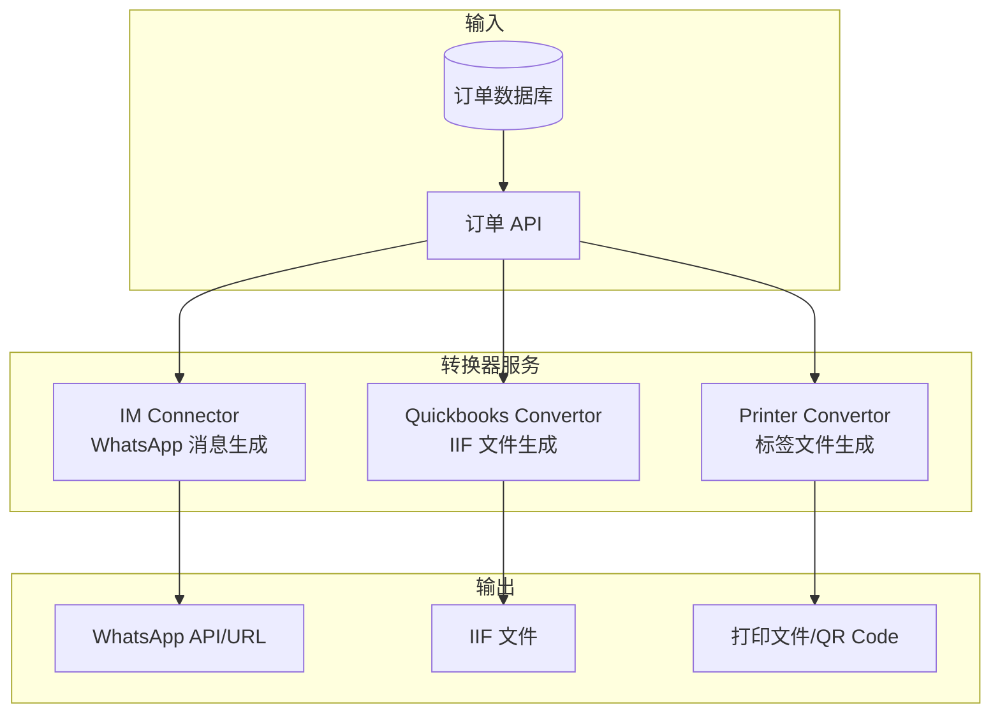
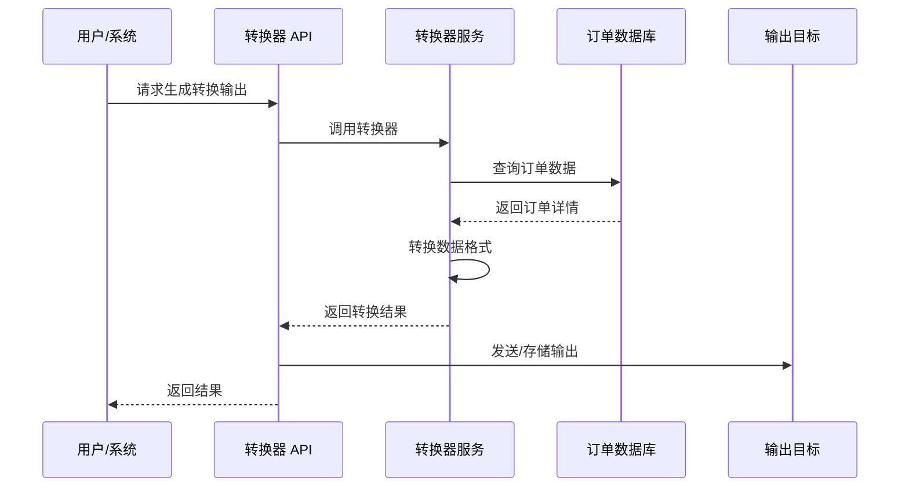
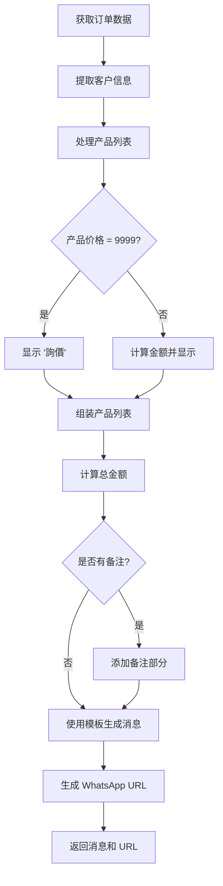
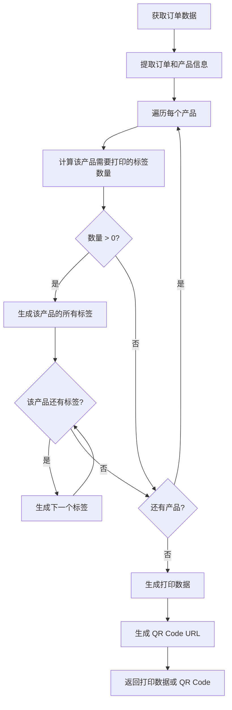

# 转换器/连接器设计

## 转换器概览

本文档详细说明 NiceOne 系统中三种转换器/连接器的设计、输入输出格式和转换逻辑。

## 转换器架构

### 整体架构



### 转换器流程



## 1. IM Connector (WhatsApp 消息生成)

### 1.1 功能说明

IM Connector 负责将订单数据转换为格式化的 WhatsApp 消息，用于发送订单通知。

### 1.2 输入数据格式

**输入**: 订单 ID 或订单对象

**订单数据结构**:
```json
{
  "id": 1,
  "invoice_id": "INV-20240101-001",
  "order_number": "SO-123456",
  "customer": {
    "customer_id": "CUST001",
    "customer_name": "ABC Company",
    "phone": "12345678",
    "address": "Hong Kong"
  },
  "items": [
    {
      "product_name": "力士香皂(混合)",
      "product_code": "P1001",
      "quantity": 5,
      "unit_price": 264.00,
      "subtotal": 1320.00
    }
  ],
  "total_amount": 2130.00,
  "notes": "AI 生成的备注"
}
```

### 1.3 消息模板

**模板定义**:
```
*新訂單 New Order*
Order ID: {order_number}
客戶: {customer_name} ({customer_id})
電話: {customer_phone}
地址: {customer_address}
----------------
{items_list}
----------------
*預計總額: HK${total_amount}*
{notes_section}
```

**模板变量**:
- `{order_number}`: 订单编号
- `{customer_name}`: 客户名称
- `{customer_id}`: 客户编号
- `{customer_phone}`: 客户电话
- `{customer_address}`: 客户地址
- `{items_list}`: 产品列表（每行一个产品）
- `{total_amount}`: 总金额
- `{notes_section}`: 备注部分（如果有）

**产品列表格式**:
```
{product_name_cn} x {quantity}箱 = ${subtotal}
```

**价格处理**:
- 正常价格: 显示金额
- 询价产品 (price=9999): 显示 "詢價"

### 1.4 转换逻辑



### 1.5 输出格式

**消息内容** (纯文本):
```
*新訂單 New Order*
Order ID: SO-123456
客戶: ABC Company (CUST001)
電話: 12345678
地址: Hong Kong
----------------
力士香皂(混合) x 5箱 = $1320
力士香皂(米色) x 3箱 = $810
----------------
*預計總額: HK$2130.00*
備註: 易碎物品，请小心搬运
```

**WhatsApp URL**:
```
https://wa.me/85265752256?text=%2A%E6%96%B0%E8%A8%82%E5%96%AE%20New%20Order%2A%0AOrder%20ID%3A%20SO-123456%0A...
```

**API 响应**:
```json
{
  "success": true,
  "data": {
    "message": "*新訂單 New Order*\nOrder ID: SO-123456\n...",
    "whatsapp_url": "https://wa.me/85265752256?text=...",
    "phone_number": "65752256"
  }
}
```

### 1.6 实现示例 (Python)

```python
def generate_whatsapp_message(order_data, phone_number="65752256"):
    """生成 WhatsApp 消息"""
    
    # 提取客户信息
    customer = order_data['customer']
    items = order_data['items']
    
    # 构建消息
    message_lines = [
        "*新訂單 New Order*",
        f"Order ID: {order_data['order_number']}",
        f"客戶: {customer['customer_name']} ({customer['customer_id']})",
        f"電話: {customer['phone']}",
        f"地址: {customer['address']}",
        "----------------"
    ]
    
    # 处理产品列表
    total = 0
    for item in items:
        if item['unit_price'] == 9999:
            display_price = "詢價"
        else:
            display_price = f"${item['subtotal']:.0f}"
            total += item['subtotal']
        
        message_lines.append(
            f"{item['product_name']} x {item['quantity']}箱 = {display_price}"
        )
    
    message_lines.append("----------------")
    message_lines.append(f"*預計總額: HK${total:.2f}*")
    
    # 添加备注（如果有）
    if order_data.get('notes'):
        message_lines.append(f"備註: {order_data['notes']}")
    
    message = "\n".join(message_lines)
    
    # 生成 WhatsApp URL
    encoded_message = urllib.parse.quote(message)
    whatsapp_url = f"https://wa.me/852{phone_number}?text={encoded_message}"
    
    return {
        "message": message,
        "whatsapp_url": whatsapp_url,
        "phone_number": phone_number
    }
```

### 1.7 API 端点

**端点**: `POST /api/orders/{id}/whatsapp`

**请求头**: `Authorization: Bearer {firebase_id_token}`

**路径参数**:
- `id`: 订单 ID

**查询参数**:
- `phone` (optional): WhatsApp 号码 (默认: 65752256)

**响应**: 见 1.5 节

## 2. Quickbooks Convertor (IIF 文件生成)

### 2.1 功能说明

Quickbooks Convertor 负责将订单数据转换为 Quickbooks 可导入的 IIF (Intuit Interchange Format) 文件。

### 2.2 IIF 文件格式

IIF 文件是制表符分隔的文本文件，用于在 Quickbooks 中导入交易数据。

**文件结构**:
```
!TRNS    TRNSID  TRNSTYPE DATE    ACCNT   NAME    AMOUNT  DOCNUM  MEMO
!SPL     SPLID   TRNSTYPE DATE    ACCNT   NAME    AMOUNT  DOCNUM  MEMO ITEM    QTY RATE    PRICE
[交易数据行]
[明细数据行]
ENDTRNS
```

### 2.3 输入数据格式

**输入**: 订单 ID 或订单对象（同 IM Connector）

### 2.4 转换逻辑

```mermaid
flowchart TD
    A[获取订单数据] --> B[提取订单信息]
    B --> C[生成交易头 (TRNS)]
    C --> D[处理每个产品]
    D --> E[生成明细行 (SPL)]
    E --> F{还有产品?}
    F -->|是| D
    F -->|否| G[添加结束标记 (ENDTRNS)]
    G --> H[生成 IIF 文件内容]
    H --> I[返回文件内容或下载链接]
```

### 2.5 字段映射

**TRNS 行字段**:
| IIF 字段 | 数据来源 | 说明 |
|----------|----------|------|
| TRNS | 固定值 "TRNS" | 交易类型 |
| TRNSID | 空 | 交易 ID（留空） |
| TRNSTYPE | 固定值 "INVOICE" | 交易类型 |
| DATE | 订单日期 | MM/DD/YYYY 格式 |
| ACCNT | 固定值 "Accounts Receivable" | 应收账款账户 |
| NAME | customer_id | 客户编号（Quickbooks ID） |
| AMOUNT | total_amount | 总金额 |
| DOCNUM | order_number | 文档编号（订单编号） |
| MEMO | 固定值 "Sales Order" | 备注 |

**SPL 行字段** (每个产品一行):
| IIF 字段 | 数据来源 | 说明 |
|----------|----------|------|
| SPL | 固定值 "SPL" | 明细类型 |
| SPLID | 空 | 明细 ID（留空） |
| TRNSTYPE | 固定值 "INVOICE" | 交易类型 |
| DATE | 订单日期 | MM/DD/YYYY 格式 |
| ACCNT | 固定值 "Sales" | 销售收入账户 |
| NAME | 空 | 留空 |
| AMOUNT | -subtotal | 金额（负数） |
| DOCNUM | order_number | 文档编号 |
| MEMO | product_name | 产品名称 |
| ITEM | product_code | 产品编号 |
| QTY | -quantity | 数量（负数） |
| RATE | unit_price | 单价 |
| PRICE | subtotal | 小计 |

### 2.6 转换规则

1. **日期格式**: 转换为 MM/DD/YYYY (如: 01/15/2024)
2. **金额格式**: 保留两位小数，正数表示收入，负数表示支出
3. **数量格式**: 明细行的数量为负数（表示销售）
4. **产品价格**: 如果 price=9999（询价），设置为 0
5. **文件编码**: UTF-8 或 ASCII

### 2.7 输出格式

**IIF 文件内容**:
```
!TRNS	TRNSID	TRNSTYPE	DATE	ACCNT	NAME	AMOUNT	DOCNUM	MEMO
!SPL	SPLID	TRNSTYPE	DATE	ACCNT	NAME	AMOUNT	DOCNUM	MEMO	ITEM	QTY	RATE	PRICE
TRNS		INVOICE	01/15/2024	Accounts Receivable	CUST001	2130	SO-123456	Sales Order
SPL		INVOICE	01/15/2024	Sales		-1320	SO-123456	力士香皂(混合)	P1001	-5	264	1320
SPL		INVOICE	01/15/2024	Sales		-810	SO-123456	力士香皂(米色)	P1002	-3	270	810
ENDTRNS
```

**API 响应** (download=false):
```json
{
  "success": true,
  "data": {
    "filename": "Inv_SO-123456.iif",
    "content": "!TRNS\tTRNSID\tTRNSTYPE\tDATE\tACCNT\tNAME\tAMOUNT\tDOCNUM\tMEMO\n...",
    "mime_type": "text/plain"
  }
}
```

**API 响应** (download=true): 直接返回文件下载 (Content-Type: text/plain, Content-Disposition: attachment)

### 2.8 实现示例 (Python)

```python
def generate_quickbooks_iif(order_data):
    """生成 Quickbooks IIF 文件"""
    
    # 生成日期 (MM/DD/YYYY)
    order_date = order_data['created_at'].strftime('%m/%d/%Y')
    
    # 构建文件内容
    lines = [
        "!TRNS\tTRNSID\tTRNSTYPE\tDATE\tACCNT\tNAME\tAMOUNT\tDOCNUM\tMEMO",
        "!SPL\tSPLID\tTRNSTYPE\tDATE\tACCNT\tNAME\tAMOUNT\tDOCNUM\tMEMO\tITEM\tQTY\tRATE\tPRICE"
    ]
    
    # 计算总金额
    total_amount = sum(
        item['subtotal'] 
        for item in order_data['items'] 
        if item['unit_price'] != 9999
    )
    
    # TRNS 行（交易头）
    trns_line = "\t".join([
        "TRNS",
        "",  # TRNSID
        "INVOICE",
        order_date,
        "Accounts Receivable",
        order_data['customer']['customer_id'],
        str(total_amount),
        order_data['order_number'],
        "Sales Order"
    ])
    lines.append(trns_line)
    
    # SPL 行（每个产品一行）
    for item in order_data['items']:
        # 处理询价产品
        if item['unit_price'] == 9999:
            amount = 0
            rate = 0
            price = 0
        else:
            amount = -item['subtotal']  # 负数
            rate = item['unit_price']
            price = item['subtotal']
        
        spl_line = "\t".join([
            "SPL",
            "",  # SPLID
            "INVOICE",
            order_date,
            "Sales",
            "",  # NAME
            str(amount),
            order_data['order_number'],
            item['product_name'],  # MEMO
            item['product_code'],  # ITEM
            str(-item['quantity']),  # QTY (负数)
            str(rate),  # RATE
            str(price)  # PRICE
        ])
        lines.append(spl_line)
    
    # 结束标记
    lines.append("ENDTRNS")
    
    # 生成文件内容
    content = "\n".join(lines)
    
    # 生成文件名
    filename = f"Inv_{order_data['order_number']}.iif"
    
    return {
        "filename": filename,
        "content": content,
        "mime_type": "text/plain"
    }
```

### 2.9 API 端点

**端点**: `POST /api/orders/{id}/iif`

**请求头**: `Authorization: Bearer {firebase_id_token}`

**路径参数**:
- `id`: 订单 ID

**查询参数**:
- `download` (optional): 是否直接下载 (true/false, 默认 true)

**响应**: 见 2.7 节

### 2.10 Quickbooks 导入步骤

1. 在 Quickbooks 中选择 "File" → "Import" → "IIF Files"
2. 选择生成的 IIF 文件
3. 确认导入
4. 检查导入的交易数据

## 3. Printer Convertor (标签打印文件生成)

### 3.1 功能说明

Printer Convertor 负责将订单数据转换为可打印的标签文件，支持批量打印和 QR Code 扫描打印。

### 3.2 输入数据格式

**输入**: 订单 ID 或订单对象（同 IM Connector）

### 3.3 标签格式

每个标签包含以下信息：
- 产品名称（中文）
- 产品规格
- 产品名称（英文）
- 订单编号
- 客户名称
- 标签序号 (如: 1/5, 2/5, ...)

### 3.4 转换逻辑



### 3.5 标签数据结构

**单个标签数据**:
```json
{
  "product_name_cn": "力士香皂(混合)",
  "product_spec": "80g x6s x24扎",
  "product_name_en": "Lux Soap (Mixed)",
  "order_number": "SO-123456",
  "customer_name": "ABC Company",
  "label_index": 1,
  "total_labels": 5
}
```

### 3.6 输出格式

#### 格式 1: JSON 格式（Web 显示）

```json
{
  "success": true,
  "data": {
    "order_id": "SO-123456",
    "customer_name": "ABC Company",
    "labels": [
      {
        "product_name": "力士香皂(混合)",
        "product_spec": "80g x6s x24扎",
        "product_name_en": "Lux Soap (Mixed)",
        "order_number": "SO-123456",
        "customer_name": "ABC Company",
        "index": 1,
        "total": 5
      },
      {
        "product_name": "力士香皂(混合)",
        "product_spec": "80g x6s x24扎",
        "product_name_en": "Lux Soap (Mixed)",
        "order_number": "SO-123456",
        "customer_name": "ABC Company",
        "index": 2,
        "total": 5
      }
    ],
    "total_labels": 8
  }
}
```

#### 格式 2: HTML 打印格式

生成 HTML 格式的打印文件，每个标签一页，支持打印样式。

**HTML 结构**:
```html
<!DOCTYPE html>
<html>
<head>
    <style>
        @media print {
            .label-card {
                break-after: page;
                page-break-after: always;
                width: 95%;
                margin: 0 auto;
                border: 2px solid black;
                padding: 10px;
                text-align: center;
            }
        }
    </style>
</head>
<body>
    <div class="label-card">
        <h1>力士香皂(混合)</h1>
        <p>80g x6s x24扎</p>
        <p>Lux Soap (Mixed)</p>
        <hr>
        <p>Order: SO-123456</p>
        <p>ABC Company</p>
        <p>1 / 5</p>
    </div>
    <!-- 更多标签... -->
</body>
</html>
```

#### 格式 3: QR Code URL

生成包含打印数据的 URL，可转换为 QR Code 供扫描打印。

**URL 格式**:
```
https://niceone.com/?printData=oid=SO-123456&cust=ABC%20Company&d=P1001-5,P1002-3
```

**URL 参数**:
- `printData`: Base64 编码的打印数据

**数据格式** (URL 编码前):
```
oid=SO-123456&cust=ABC Company&d=P1001-5,P1002-3
```

**参数说明**:
- `oid`: 订单编号
- `cust`: 客户名称（URL 编码）
- `d`: 产品明细，格式为 `product_code-quantity`，多个用逗号分隔

### 3.7 打印模式处理

当用户访问带有 `printData` 参数的 URL 时，前端应：

1. 解析打印数据
2. 查询产品信息
3. 生成标签 HTML
4. 自动触发打印或显示打印按钮

### 3.8 实现示例 (Python)

```python
def generate_print_labels(order_data, format="json"):
    """生成打印标签数据"""
    
    labels = []
    total_labels = 0
    
    # 遍历订单中的每个产品
    for item in order_data['items']:
        quantity = item['quantity']
        product = item['product']
        
        # 为每个产品生成对应数量的标签
        for i in range(1, quantity + 1):
            label = {
                "product_name": product['name_cn'],
                "product_spec": product['spec'],
                "product_name_en": product['name_en'],
                "order_number": order_data['order_number'],
                "customer_name": order_data['customer']['customer_name'],
                "index": i,
                "total": quantity
            }
            labels.append(label)
            total_labels += 1
    
    if format == "json":
        return {
            "order_id": order_data['order_number'],
            "customer_name": order_data['customer']['customer_name'],
            "labels": labels,
            "total_labels": total_labels
        }
    
    elif format == "qrcode":
        # 生成打印数据 URL
        items_str = ",".join([
            f"{item['product']['product_code']}-{item['quantity']}"
            for item in order_data['items']
        ])
        
        print_payload = (
            f"oid={order_data['order_number']}"
            f"&cust={urllib.parse.quote(order_data['customer']['customer_name'])}"
            f"&d={items_str}"
        )
        
        encoded_payload = urllib.parse.quote(print_payload)
        print_url = f"https://niceone.com/?printData={encoded_payload}"
        
        return {
            "print_url": print_url,
            "qrcode_data": print_url
        }
    
    elif format == "html":
        # 生成 HTML 打印文件
        html_parts = [
            "<!DOCTYPE html>",
            "<html>",
            "<head>",
            "<style>",
            "@media print {",
            "  .label-card { break-after: page; page-break-after: always; }",
            "}",
            "</style>",
            "</head>",
            "<body>"
        ]
        
        for label in labels:
            html_parts.append(
                f"""
                <div class="label-card">
                    <h1>{label['product_name']}</h1>
                    <p>{label['product_spec']}</p>
                    <p>{label['product_name_en']}</p>
                    <hr>
                    <p>Order: {label['order_number']}</p>
                    <p>{label['customer_name']}</p>
                    <p>{label['index']} / {label['total']}</p>
                </div>
                """
            )
        
        html_parts.append("</body>")
        html_parts.append("</html>")
        
        return {
            "filename": f"Labels_{order_data['order_number']}.html",
            "content": "\n".join(html_parts),
            "mime_type": "text/html"
        }
```

### 3.9 API 端点

**端点**: `POST /api/orders/{id}/print`

**请求头**: `Authorization: Bearer {firebase_id_token}`

**路径参数**:
- `id`: 订单 ID

**查询参数**:
- `format` (optional): 输出格式 (json/qrcode/html/file, 默认 json)

**响应示例** (format=json):
```json
{
  "success": true,
  "data": {
    "order_id": "SO-123456",
    "customer_name": "ABC Company",
    "labels": [...],
    "total_labels": 8
  }
}
```

**响应示例** (format=qrcode):
```json
{
  "success": true,
  "data": {
    "print_url": "https://niceone.com/?printData=...",
    "qrcode_data": "https://niceone.com/?printData=..."
  }
}
```

**响应示例** (format=html 或 file):
直接返回 HTML 文件下载

### 3.10 前端打印处理

前端需要处理打印模式（当 URL 包含 `printData` 参数时）：

```javascript
// 解析打印数据
const urlParams = new URLSearchParams(window.location.search);
const printData = urlParams.get('printData');

if (printData) {
    // 解码数据
    const params = new URLSearchParams(decodeURIComponent(printData));
    const orderId = params.get('oid');
    const custName = params.get('cust');
    const itemsStr = params.get('d');
    
    // 解析产品明细
    const items = itemsStr.split(',').map(item => {
        const [productCode, quantity] = item.split('-');
        return { productCode, quantity: parseInt(quantity) };
    });
    
    // 生成标签 HTML
    const labels = generateLabels(orderId, custName, items);
    
    // 显示打印界面
    renderPrintMode(labels);
}
```

### 3.11 打印样式

**标签尺寸**: 根据打印机规格设置（如 HPRT N31bt）

**样式要求**:
- 每个标签独立一页
- 居中对齐
- 清晰的字体大小
- 黑色边框
- 适合标签纸尺寸

## 转换器通用设计

### 错误处理

所有转换器都应处理以下错误情况：

1. **订单不存在**: 返回 404 错误
2. **订单数据不完整**: 返回 400 错误，说明缺少的字段
3. **转换失败**: 返回 500 错误，记录详细日志

### 日志记录

所有转换操作都应记录日志，包括：
- 转换时间
- 订单 ID
- 转换类型
- 转换结果
- 错误信息（如有）

### 性能优化

1. **缓存**: 对于频繁查询的订单，可以缓存订单数据
2. **异步处理**: 大文件生成可以异步处理
3. **流式输出**: 大文件可以流式输出，避免内存溢出

### 测试建议

1. **单元测试**: 测试转换逻辑
2. **集成测试**: 测试 API 端点
3. **格式验证**: 验证输出格式正确性
4. **边界测试**: 测试空订单、大订单等边界情况

## 总结

三种转换器各司其职：
- **IM Connector**: 生成友好的 WhatsApp 消息
- **Quickbooks Convertor**: 生成标准的 IIF 文件
- **Printer Convertor**: 生成可打印的标签文件

所有转换器都基于订单数据，确保数据一致性。
